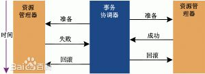

# 第九章 一致性和共识

分布式系统容易产生各种各样的错误，最简单的方法就是让系统报错，然后重启。不过很多时候这个方法不可接受。此时就需要有容错性, 容错性实现的方式是找到一些解决错误的抽象方法，比如原子性，孤立性，持久性等。本章的主要抽象是**共识(consensus)**。

达到共识的方法非常有用，可以解决诸如`选出新leader`之类的问题。我们还需要明白什么时候系统可以处理错误然后继续工作下去，什么时候我们不得不停下解决当前的问题。

## 一致性保证

因为不同节点接到写数据的请求的时间不一样，所以数据的不一致不可避免。大多数的数据库都采用**逐渐一致性(eventual consistency)**的方法。但是这种一致性非常脆弱，它没有规定达到一致性所需要的时间。本章节会说一些实现更强的一致性的方法，不过他们会在性能或者容错上有些问题。

## 线性一致性

**线性一致性(Linearizability)**，又叫**原子一致性(atmoic consistency)**，**强一致性(strong consistency)**，**立刻一致性(immediate consistency)**：意思是

> 行为上就像只有一份数据，而且在其上面的操作为原子操作。

### 什么使得系统线性
在一个线性性的系统里面，如果我们写了一个值，那么存在某个时刻（写请求发送，到写请求结果返回之间）前我们读到的值永远是旧值，而此时刻之后读到的值永远是新值。测量系统线性度的方法是：将请求排序，看他们是否存在依次顺序。

> 线性一致性和串行化
> 两者都有将物品排列的意思，所以容易混淆。两者的区别在于：
> - 串行化是一种事物孤立属性，事物会同事读写多个对象。串行化保证了事物处理是有序处理的。但是不保证不同节点上数据同时变化。
> - 线性性：是读写单个寄存器的性质,它保证了多个节点上数据同时变化，但是不保证多次执行形成一个序列。它也不会阻写偏斜这样的事物处理错误发生。

### 依赖线性一致性的场景

- leader选举: 过程中大家都会争夺一个锁，这个锁必须有线性一致性，不然就可能导致脑裂。
- 约束和唯一性保证: 分布式文件系统中，线性一致性可以防止大家创建相同的文件名，类似选举leader，我们可以认为写入数据的节点获得了一个这个文件的锁。还有银行账户信息也需保证不同节点上同一个账户的余额拥有线性一致性。
- 跨信息通道时间依赖: 如果有多条通信渠道线性不一致性可能导致信息传递的混乱。

### 实现线性一致性的系统 
- 单leader节点备份: 潜在的线性一致性(leader上有线性一致性）。
- 共识算法：线性一致性。
- 多leader节点备份: 没有线性一致性。
- 无leader节点备份：可能没有线性一致性。具体情况取决于读写索取的仲裁人数。

#### 线性一致性和仲裁人数
严格仲裁读写人数并不能保证线性一致性。

### 线性一致性的代价
#### CAP 理论
拥有线性一致性会导致可用性下降，而如果要让系统高可用则会导致失去线性一致性。这也是CAP理论中的一部分，CAP理论可以让我们根据需求设计不同类型的分布式数据库。

> CAP理论包括一致性，可用性和可分离性，但是可分离性会由网络错误引起。这是必然发生的事情而不是可选方案。所以实际上CAP是让我们选择，在网络错误发生时是一致性更加重要还是可用性更加重要。而且CAP理论中的可用性并不是我们通常所指的可用性，事实上很多所谓的“高可用”系统并不满足CAP系统中的可用性。CAP中有大量的误解和混淆，最好避开它。

#### 线性一致性和网络延迟
多核多线程CPU中内存可能出现不一致，这时候也无法用CAP理论解释。此时更多是因为考虑性能。网络中的延迟，再加上线性一致性会对性能产生比较大的影响。

## 顺序保证
因为线性一致性使得数据如同只有一份拷贝一样，具有原子操作性。所以数据上的操作就拥有了顺序。一致性和顺序性还有共识具有某种内在联系。

### 顺序性和因果律
顺序性可以保证因果律。顺序性的系统可以保证事物发生按照一定先后顺序，先发生的可以影响后发生的，后发生的受到先发生的影响，而不是反过来。

#### 因果顺序不是完全的顺序性
完全顺序性中任意发生的事件都可以比较顺序。
- 线性一致性会导致完全顺序性。此时数据库拥有单一的时间轴。
- 而因果性则是部分顺序性，只有两件事情具有因果性时候它们才有顺序性。此时数据库可以分成互不影响的多条时间轴，不同时间轴上的数据会分开和合并。(类比git的branch控制)

#### 线性一致性比因果一致性要更强
线性一致性可以保证因果一致性，但是线性一致性会导致性能上的损失，所以很多时候我们需要作出权衡。因果一致性是我们所知性能最强的，不会受到网络延迟影响速度的一致性模型。

#### 捕捉因果依赖
为了实现因果一致性，我们需要分清因果依赖。为了实现这点，我们需要针对整个数据库进行版本控制，保证后面的操作都是在知道之前系统状态基础上进行的。为了解决这个问题可以使用版本向量。

### 序列数字顺序
要同时跟踪这么多因果关系不现实，所以我们需要使用更容易实现的方式，使用`timestamp`来表示事件的顺序。(注意这里的timestamp并不是物理时钟中的时间戳，而是逻辑时间戳)。这种时间戳是紧凑的而且提供了完全的顺序性。比如在单leader集群上，leader的log就可以代表写入的顺序和因果关系。

#### 无因果序列数据生成
对于没有单leader的系统或者因为partition而分离的系统有如下方法可以用来生成序列数据。
- 不同节点生成不同余数的序列, 比如一个生成单数一个双数保证两者不会重复。
- 后写入者胜利方法中可以利用每台机器自己的时间戳。
- 不同机器拥有不同序列候选集。

这三种方法都比单leader集群性能更好，但是都无法生成因果顺序。

#### Lamport 时间戳

由 *Lamport* 发明，每台机器记录时记录（计数器，节点ID）这样一个数据对。对于计数器数不同的数据，计数器小的先发生;一样时，ID小的先发生。

#### 时间戳顺序并不够

这方法虽然提供完全顺序性，但是无法保证在操作时，迅速察觉错误，返回用户。因为只有当我们得到整个序列才能得到冲突信息。只有当我们确定我们操作顺序前没有任何冲突时我们才能宣布此次操作成功，这就需要用到完全顺序广播。

### 完全顺序广播
上文已经讨论过对于单 **leader**节点，leader上的顺序就是执行顺序。但是如果集群大到单节点对付不了或者出现leader宕机。这时候就需要处理顺序问题，这种问题叫做**完全顺序广播**或者叫**原子广播**。完全顺序广播需要满足如下两条：

- 可靠性传递（没有数据丢失）。
- 完全顺序传递(数据到达所有节点都拥有相同的顺序）。

#### 使用完全顺序广播
一致性服务比如 **ZooKeeper** 和 **etcd** 都实现了完全顺序广播。完全一致性广播已经广播的内容无法插队。

#### 使用完全顺序广播实现线性一致性存储
完全顺序广播只保证广播的内容顺序是固定的，但是无法保证广播的内容什么时候送达。所以它只能保证线性一致性写操作，但是无法保证线性一致性读操作。实现线性一致性读可以采用：
- 将读也用完全顺序广播发送。
- 从日志中找到最新日志信息，等待节点更新到这个地方，然后进行读操作。
- 可以使用同步读写操作，保证最新能容确定被写入。

#### 使用线性一致性存储实现完全顺序广播
一致性存储维护一个依次递增的日志序列。然后按照序列依次广播，节点可以根据收到信息的序号知道执行顺序。

线性一致性寄存器, 完全顺序广播和共识三者是等价的，实现一个就自动实现了另外两种。

## 分布式事物和共识
共识：分布式计算中最重要也是最根本的问题
 需要共识的典型场景：
- Leader选举。
- 原子提交。

> 共识的不可能性: 根据FLP结论，没有算法可以完全保证一个异步模型在节点失败时的共识。

### 原子提交和二相提交
原子提交：要么成功，要么失败，不会处在部分成功部分失败，主要用于（一次提交多个操作）。

#### 从单节点到多节点原子提交
单节点的原子写入一般由存储引擎保证,依靠日志记录来提供。但是多节点提交要复杂很多。

#### 二相提交介绍
二相提交（2PC)是一种分布式数据库的经典算法。其时序图如下：

> 要注意二相提交和二相锁完全不同。不要混淆其概念。
